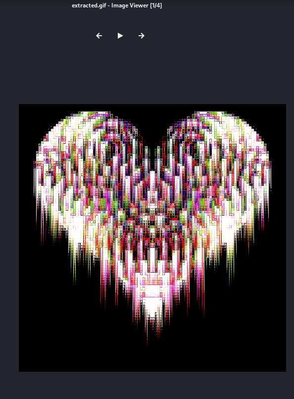
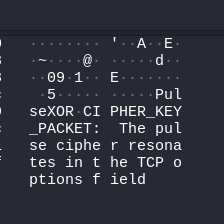
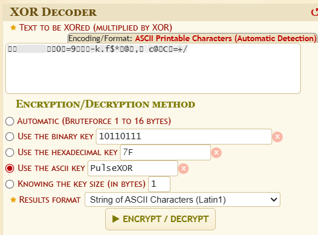
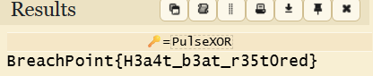

**Hint1:** **"Look** **inside** **TCP** **header** **options** **to**
**find** **the** **key** **“**

**Description**

In a pixel-drifted, digitally decaying world, a once-powerful server is
failing, struggling to maintain its heartbeat in corrupt network traffic.
The server’s last narrative logs and corrupted pixel heart GIF pulses
flicker through fragmented TCP streams. The cipher key "PulseXOR" is
hidden within suspicious TCP header options.

Files Provided:

> ● A **.pcap**file capturing the network traffic from the dying server.
>
> ● The pcap contains multiple TCP streams carrying narrative logs, GIF
> data chunks, and TCP header options with the XOR key

**Solution**

> 1\. Analyze the PCAP with Wireshark or similar: ● Follow TCP streams
> on specific ports:
>
> ● Narrative system logs on port 514.
>
> ● Pixel heart GIF data chunks on port 8080.
>
> ● XOR cipher key embedded in TCP header options on port 12345. ●
> Filter and isolate these streams for focused examination.
>
> 2\. Reconstruct the GIF:
>
> ● Follow tcp stream on port 8080, the corrupt GIF header (GFI89a
> instead of GIF89a - shows it's a GIF file)
>
> ● Convert to raw and save as a .gif file. ● Verify the GIF integrity by
> opening it.

> 3\. Retrieve the XOR Key:
>
> ● Inspect TCP header options for option number 254.
>
> ● The key "PulseXOR" is transported cleanly without corruption. ●
> Capture this key for further decoding or verification.
>
> 4\. Decrypt or Use the Extracted Data:
>
> ● Use the XOR key to decode any additional encrypted data ( 3 base64
> encoded strings in comments of the GIF file)

**Reference**

[<u>https://www.linkedin.com/pulse/2022-awake-pcap-ctf-challenge-ighor-tavares</u>](https://www.linkedin.com/pulse/2022-awake-pcap-ctf-challenge-ighor-tavares)
