**Write-up:** **Strike** **Bank** **Employee** **Portal**
**Exploitation**

**1.** **Information** **Gathering** **&** **Reconnaissance**

The assessment began with analysis of a BeVigil report related to the
**Strike** **Bank** Android application. The report exposed multiple
sensitive assets, which collectively defined the initial attack surface.

**Leaked** **Assets** **Identified:**

> ● **Firebase** **URL**[**:**
> <u>https://strike-projectx-1993.firebaseio.com/</u>](https://strike-projectx-1993.firebaseio.com/)
> ● **Auth** **token** **in** **report** **base64** **decoded** **to**
>
> **GitHub** **Personal** **Access** **Token** **(PAT):**
> github_pat_11B2PT...
>
> ● **Server** **IP:** 15.206.47.5:8080 (identified from Dockerfile
> comments)
>
> 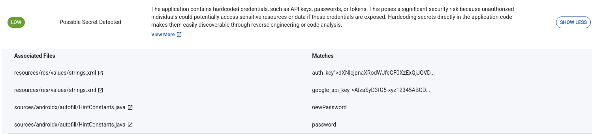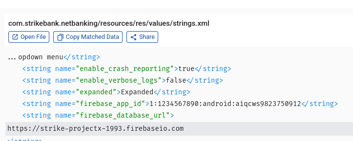
●
> **Initial** **Credentials:** support@strikebank.com / newPassword
> (observed in report logs)

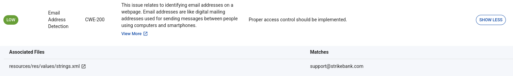

**2.** **GitHub** **Asset** **Analysis**

The exposed GitHub Personal Access Token was used to interact with the
GitHub API and enumerate private repositories associated with the
developer account. This led to the discovery of a repository containing
the source code for the bank’s employee portal.

Initial inspection of login.php showed that sensitive values had been
sanitized in the current version of the code:

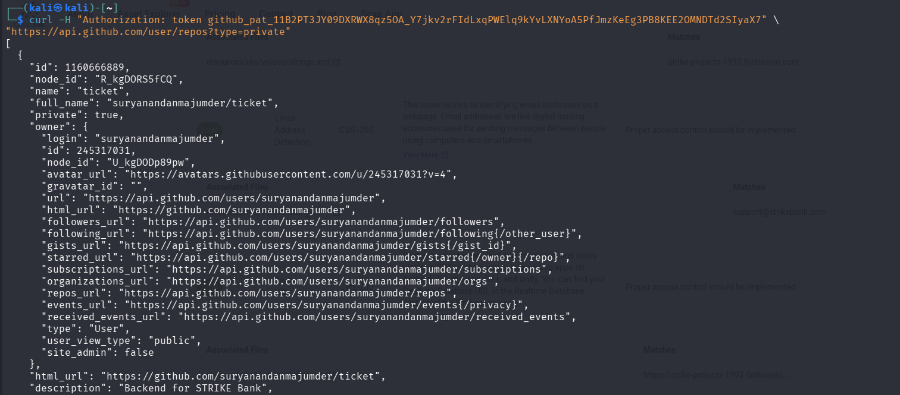
\$logins
= array('' =\> ''); // Credentials removed \$secret = ''; // Secret
removed

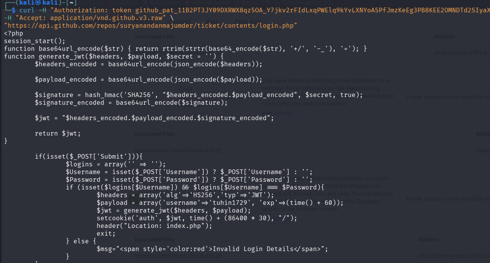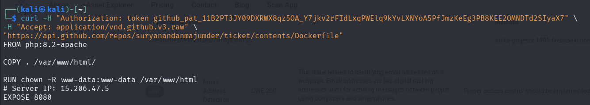

Revealed ip and port from docker file

**3.** **Git** **Commit** **History** **Forensics**

Given that the production server remained active, it was likely running
an older build of the application or that repository sanitization had
been incomplete. Commit history was audited using the GitHub API to
identify previous versions of the code.

**Relevant** **Commits:**

> ● **c1d8478:** “Add login functionality with JWT authentication.” ●
> **aa5bb88:** “Change default JWT secret to an empty string.”

Reviewing commit c1d8478 revealed previously hardcoded sensitive data
that had not been purged from the repository history.

**Recovered** **Secret:**

> 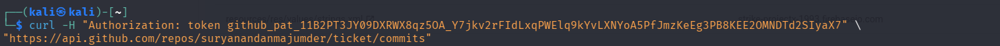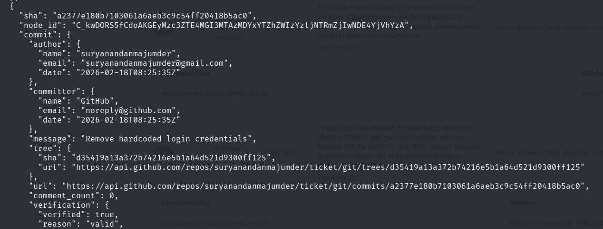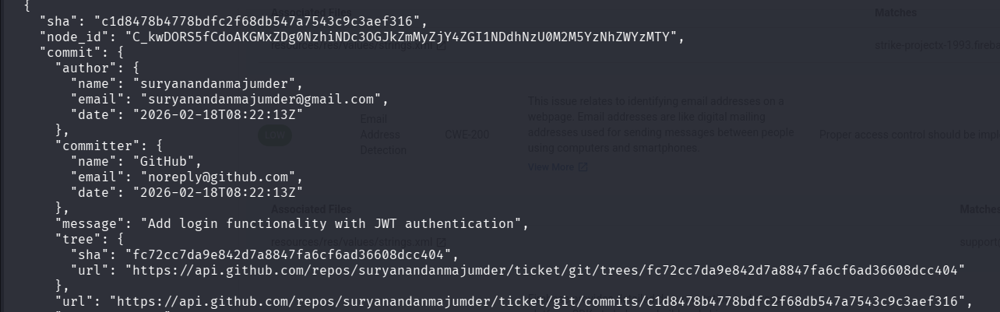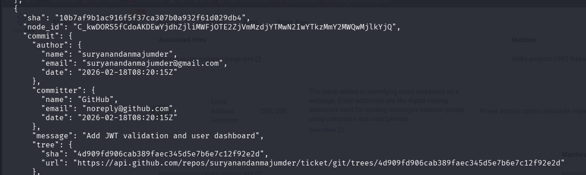●
> **JWT** **Signing** **Secret:** Str!k3B4nkSup3rs3cr37

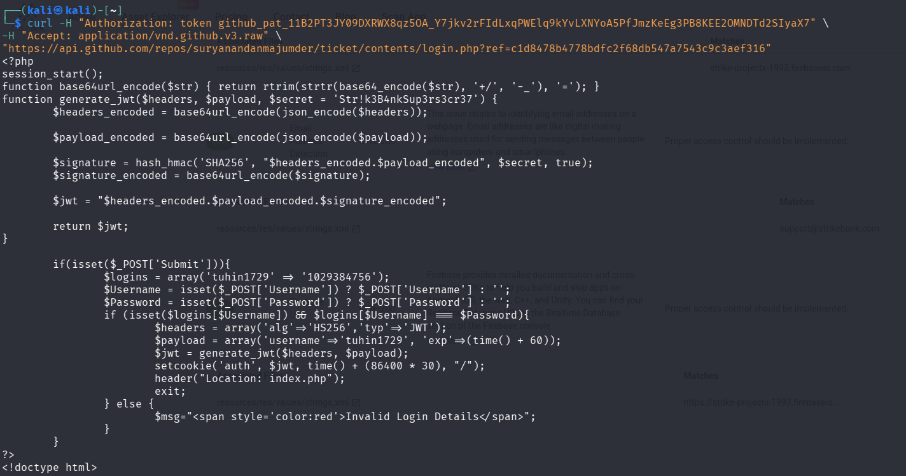

**4.** **JWT** **Forgery** **&** **Privilege** **Escalation**

Analysis of index.php on the live server showed that authentication
relied on a JWT stored in the auth cookie. Authorization logic included
the following conditional check:

if (\$payload-\>username === 'admin') { echo \$flag;

}

Because the JWT used the HS256 algorithm and the signing secret was
known, it became possible to generate a valid token with an arbitrary
payload. This allowed impersonation of the admin user without requiring
valid credentials.

A PHP script (solve.php) was created to replicate the server’s Base64URL
encoding and HMAC-SHA256 signing process. The payload
{"username":"admin"} was signed using the recovered JWT secret.

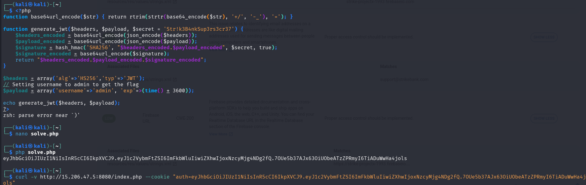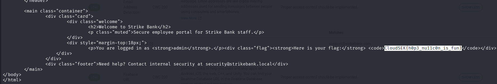

**5.** **Final** **Execution**

The forged JWT was injected into the auth cookie and sent to the
application using curl.

curl -v http://15.206.47.5:8080/index.php --cookie "auth=\[FORGED_JWT\]"

The server verified the token signature using the compromised secret,
trusted the forged admin identity, and returned the protected flag in
the HTTP response.

**6.** **Lessons** **Learned**

> ● **Secrets** **Management:** Secrets must never be hardcoded in
> source code, even temporarily. Environment variables or dedicated
> secret managers should be used instead.
>
> ● **Git** **History** **Persistence:** Removing a secret in a later
> commit does not eliminate it from version history. Tools such as
> git-filter-repo or **BFG** **Repo-Cleaner** are required to fully
> purge sensitive data.
>
> ● **JWT** **Security:** JWT signing secrets should be long, randomly
> generated, securely stored, and rotated periodically to reduce the
> risk of token forgery.
